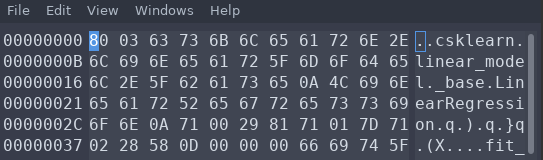

# StegoRegression

We have `model` file and `'sssfAfsDfe%%%{dInIisdChdh*e]DHSdbeTNhfhdyeSSWTTFSSSllfjdjs{\\#3fdas34df7adJHHstcsdDFur3sfj_1mdfneypcs0KJDsrsFs7sd4nfec3_sdrufdl35}453'` string.

If we open `model` in any hex editor we will see that it looks like a Python pickle with LinearRegression object inside:



Let's try to unpickle it:

```
import pickle
import numpy as np

model = None
with open('StegoRegression/model', 'rb') as p:
    model = pickle.load(p)
```

Yay, it works! But how to use it? If we call `help(model)` we will find out there is a `.predict()` method which takes single parameter `X`, shape (n_samples, n_features). But how many features it should be? Our `model` object also have `n_features_in_` attribute which is equal to `2`. 

If we'll try to call `.predict()` on something like 
```
arr = np.zeros((924,2))
model.predict(arr)
```
we will get an intresting error:
```
--> 346 return safe_sparse_dot(X, self.coef_.T, dense_output=True) + self.intercept_

AttributeError: 'list' object has no attribute 'T'
```
What's inside `.coef_`? 
```
''.join(map(str,model.coef_))
```
It's an array with ones and zeroes!
```
'00001000000000010000010000000000001000000...1000'
```
And `n_features` is equal to two, so we are dealing with some binary logic. If we'll compare length of our given string and `coef_` array we will notice that they are also equal. The first thing that comes to mind is to take only that chars in string which position highligted by one in `coef_`:
```
idk = 'sssfAfsDfe%%%{dInIisdChdh*e]DHSdbeTNhfhdyeSSWTTFSSSllfjdjs{\\#3fdas34df7adJHHstcsdDFur3sfj_1mdfneypcs0KJDsrsFs7sd4nfec3_sdrufdl35}453'
flag = ''
for i,j in enumerate(model.coef_):
    if int(j):
        flag += idk[i]
```
Flag is `'AICTF{f347ur3_1mp0r74nc3_rul35}'`.
