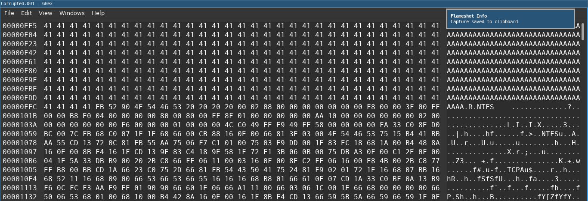
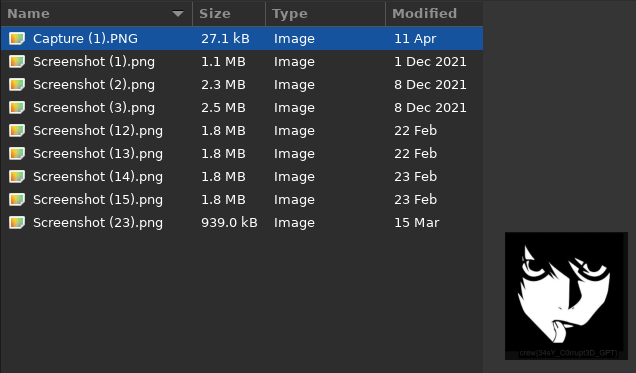

# Corrupted

We have Corrupted.001 file without any extension.
When we try to figure out what is this using `file Corrupted.001` we just get 'data' instead of file type.
So, let's open it with Ghex

We see a lot of trash before a valid NTFS-header `EB 52 90 4E 54 46 ...`. We just delete this bytes and save files as "Corrupted". Next, mount it using `ntfs-3g` and see a flag inside a directory with pictures:

