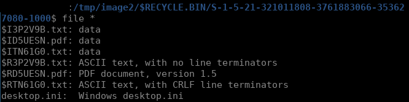
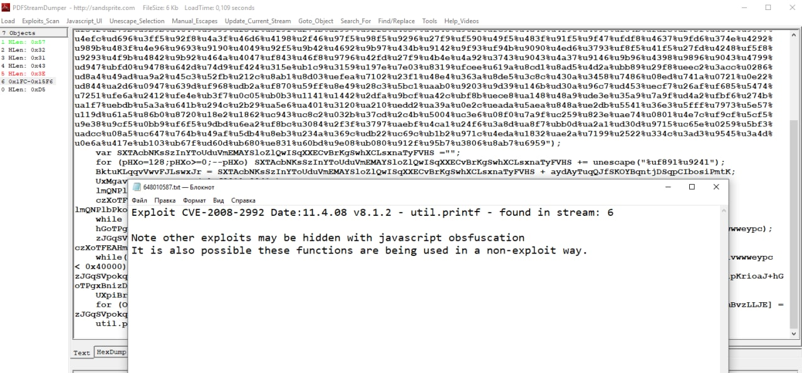
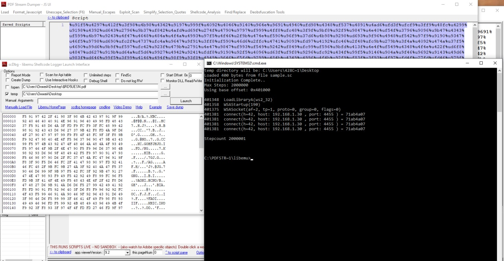

# Policy Violation

We have an Expert Witness File (EWF) Image.E01.

## Pt. 1

I've made a temporary directory `mkdir /tmp/image` as mount point to image. To work with .EWF files we need a ewf-tools package on system. After mounting image with `ewfmount Image.E01 /tmp/image/` I've discovered single file `ewf1` inside it. I get that it a NTFS file system running `xxd ewf1 | head` and copied it from read-only partition to the home directory. Next I've mounted it with `ntfs-3g ewf1 /tmp/image2` command.

I did a `file *` in single directory inside $RECYCLE.BIN and noticed that there are single valid PDF-file inside.

I copied it to Windows machine with [PDF Stream Dumper](http://sandsprite.com/blogs/index.php?pid=57&uid=7) installed and hit the "Exploits_Scan" button.

## Pt. 2

We already noticed a suspicious stream inside PDF in the previous step, so now we should open "JavaScript_UI" window and select the payload between quotes. Next step is just hit "Shellcode_analysis->scDbg – LibEmu Emulation".

## Conclusion

Both tasks was created using [this article](https://linuxsecurityblog.com/2018/11/12/payload-in-pdf/) and focused on mentioned software so the most difficult part was to find it out.